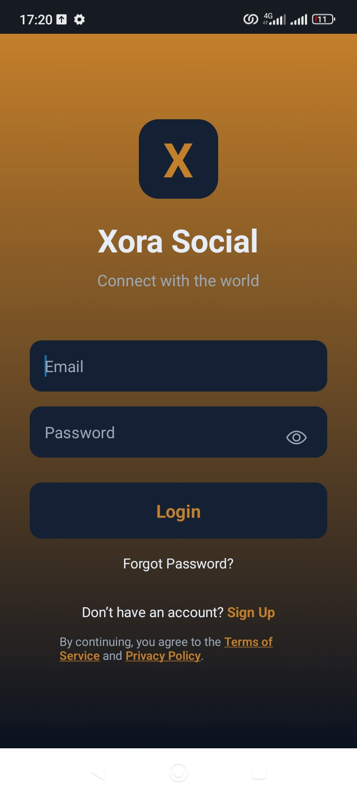
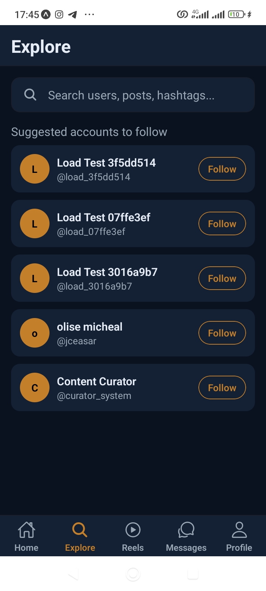
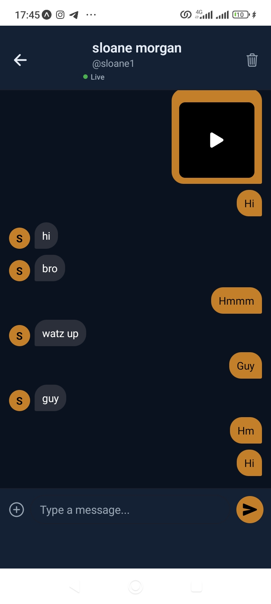
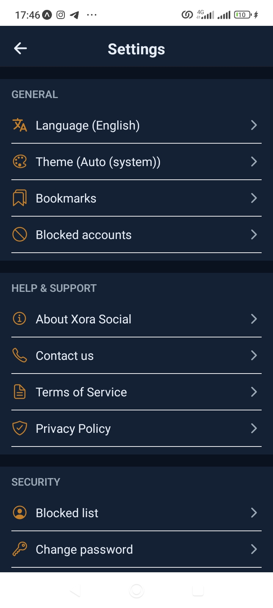
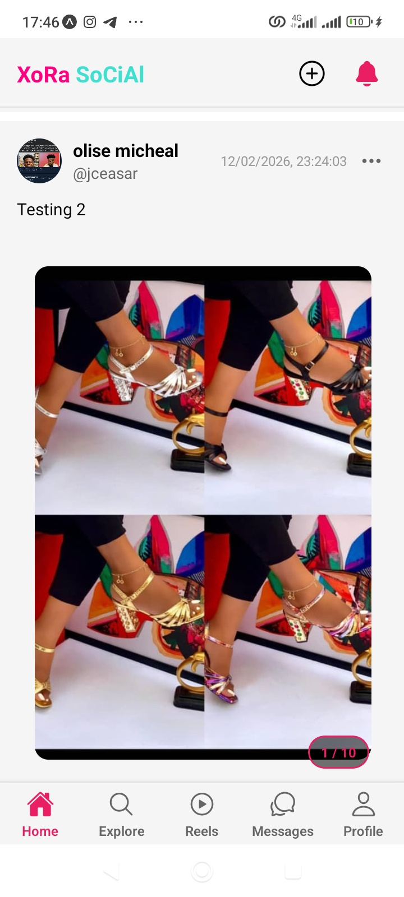
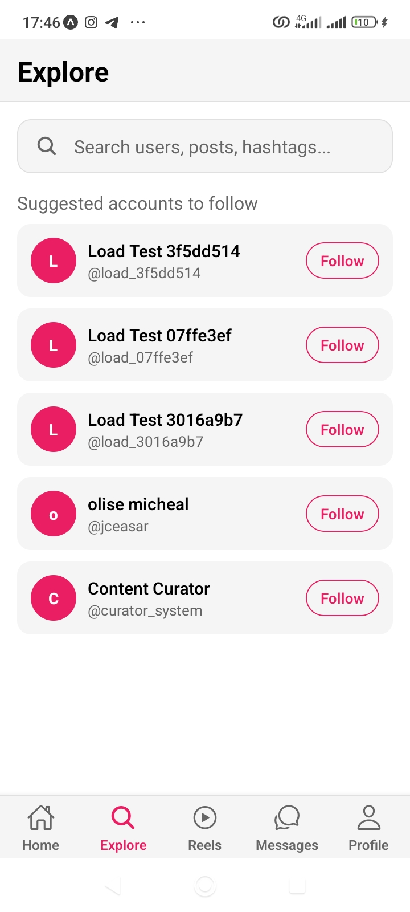
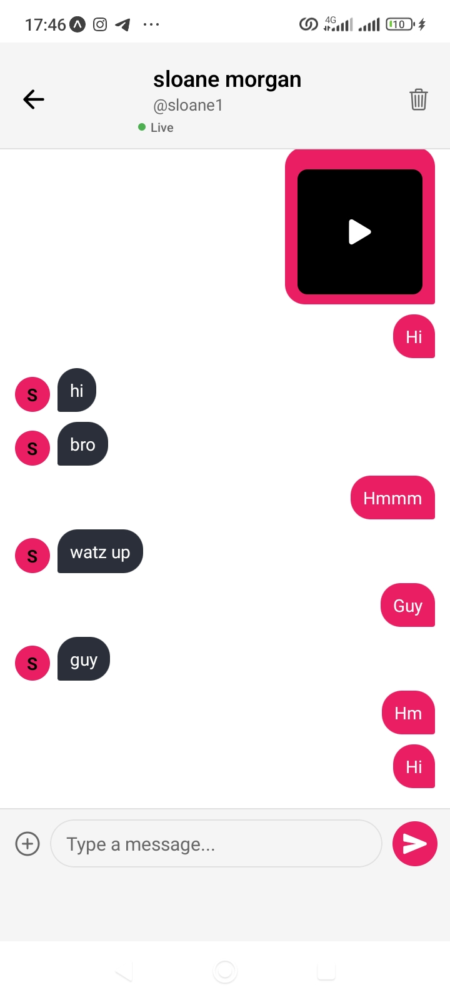
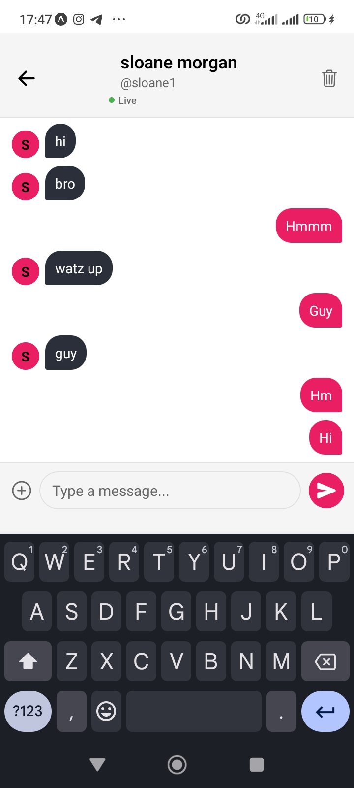

# Xora Mobile

Expo/React Native mobile client for the Xora social platform.

## Overview

Xora Mobile delivers the social feed, reels, messaging, profile, and account flows in a native mobile-first experience backed by the same broader platform APIs.

## Highlights

- auth, feed, reels, profile, messaging, and settings flows
- Expo-based React Native app with Android project files included
- shared media components for image/video handling
- mobile-first navigation and screen structure
- push, verification, and moderation-aware client workflows

## Stack

- React Native
- Expo
- Android native project
- Context/state-driven client architecture

## Local Development

```bash
npm install
npm run start:offline
```

Main entry points:
- `App.js`
- `src/App.js`
- `src/navigation/MainNavigator.js`

## Screenshots

### Feed And Auth Flows














## Structure

- `src/components/` - reusable mobile UI pieces
- `src/screens/` - screen-level app flows
- `src/navigation/` - navigation setup
- `src/contexts/` - auth, moderation, and session state
- `assets/` - app icons, splash assets, and static media

## Environment

Use `.env.example` for local app configuration.

## Repo Scope

This repository is the standalone mobile client for Xora.
